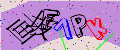
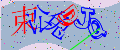
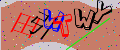
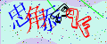
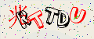
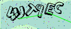
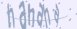

# 国税局验证码识别
## 自动生成验证码
训练一个机器学习模型需要大量训练数据，该项目作为一个典型的多分类任务，标签数量至少也在上千个（字母26+数字10+中文上千），需要把字符全部覆盖到的话至少也得几万到几十万的样本，手工标注显然不可行，因此需要一套自动生成验证码的工具。
### 验证码生成规律解析
手动收集一些验证码，如图所示：










通过观察图片可以发现以下规律：
- 验证码由6个字符（数字/字母/汉字）组成，包括4种颜色（红/黄/蓝/黑）。
- 字符进行了随机角度的旋转。
- 所有字符有相似的大小和统一的字体（汉字为宋体，数字字母为actionj字体）。
- 如果验证码中有汉字，汉字全都在前面，数量为0-3个。
- 汉字做了大约往右12度的剪切变换。
- 验证码图片为宽120、高50的三通道RGB图像。
- 图片背景由两条随机三角函数曲线划分成多块，包含两种随机的背景颜色。
- 只生成一个随机的三角函数曲线，然后从中间切成两半，下半部分是上曲线，上半部分是下曲线。
- 图片左上角一定是三角函数曲线的颜色，表明三角函数起点存在一些规律。
- 最上面和最左边各有一条线，颜色和左上角相同。
- 图片上有0-2根位置和长度都随机的干扰线，颜色为绿色。
- 图片上大约有150个噪点，颜色随机，且都叠加在最上层。

对收集到的一些验证码进行统计分析：
```python
import os

count = {"0": 0, "1": 0, "2": 0, "3": 0}
symbol_set = set()
files = os.listdir("./captcha")
for file in files:
    content = file.split('_')[0]
    if "\u4e00" <= content[2] <= "\u9fff":
        count["3"] += 1
        for i in range(3, 6):
            symbol_set.add(content[i])
    elif "\u4e00" <= content[1] <= "\u9fff":
        count["2"] += 1
        for i in range(2, 6):
            symbol_set.add(content[i])
    elif "\u4e00" <= content[0] <= "\u9fff":
        count["1"] += 1
        for i in range(1, 6):
            symbol_set.add(content[i])
    else:
        count["0"] += 1
        for i in range(6):
            symbol_set.add(content[i])
print("不含中文的比例：", count["0"] / len(files))
print("含一个中文的比例：", count["1"] / len(files))
print("含两个中文的比例：", count["2"] / len(files))
print("含三个中文的比例：", count["3"] / len(files))
print("除中文以外的符号：", sorted(symbol_set))
```
输出结果如下：
```
不含中文的比例： 0.7155963302752294
含一个中文的比例： 0.10550458715596331
含两个中文的比例： 0.0963302752293578
含三个中文的比例： 0.08256880733944955
除中文以外的符号： ['2', '3', '4', '5', '6', '7', '8', '9', 'A', 'B', 'C', 'D', 'E', 'F', 'G', 'H', 'I', 'J', 'K', 'L', 'M', 'N', 'P', 'Q', 'R', 'S', 'T', 'U', 'V', 'W', 'X', 'Y', 'Z']
```
- 数字没有0和1（防止和字母I混淆），字母没有O（防止和数字0混淆）。
- 不含中文以及各含一个、两个、三个中文之间大致符合0.7 : 0.1 : 0.1 : 0.1的比例关系，后面生成训练集时也要尽量保持这个比例。
### 验证码图片生成——captcha
python中有一款验证码生成的库captcha。`pip install captcha`
```python
from captcha.image import ImageCaptcha
chars = "hahaha"
image = ImageCaptcha().generate_image(chars)
image.show()
```
效果如图：


查看一下ImageCaptcha类的源码：
```python
class ImageCaptcha(_Captcha):
    """Create an image CAPTCHA.

    Many of the codes are borrowed from wheezy.captcha, with a modification
    for memory and developer friendly.

    ImageCaptcha has one built-in font, DroidSansMono, which is licensed under
    Apache License 2. You should always use your own fonts::

        captcha = ImageCaptcha(fonts=['/path/to/A.ttf', '/path/to/B.ttf'])

    You can put as many fonts as you like. But be aware of your memory, all of
    the fonts are loaded into your memory, so keep them a lot, but not too
    many.

    :param width: The width of the CAPTCHA image.
    :param height: The height of the CAPTCHA image.
    :param fonts: Fonts to be used to generate CAPTCHA images.
    :param font_sizes: Random choose a font size from this parameters.
    """
    def __init__(self, width=160, height=60, fonts=None, font_sizes=None):
        self._width = width
        self._height = height
        self._fonts = fonts or DEFAULT_FONTS
        self._font_sizes = font_sizes or (42, 50, 56)
        self._truefonts = []

    @property
    def truefonts(self):
        if self._truefonts:
            return self._truefonts
        self._truefonts = tuple([
            truetype(n, s)
            for n in self._fonts
            for s in self._font_sizes
        ])
        return self._truefonts

    @staticmethod
    def create_noise_curve(image, color):
        w, h = image.size
        x1 = random.randint(0, int(w / 5))
        x2 = random.randint(w - int(w / 5), w)
        y1 = random.randint(int(h / 5), h - int(h / 5))
        y2 = random.randint(y1, h - int(h / 5))
        points = [x1, y1, x2, y2]
        end = random.randint(160, 200)
        start = random.randint(0, 20)
        Draw(image).arc(points, start, end, fill=color)
        return image

    @staticmethod
    def create_noise_dots(image, color, width=3, number=30):
        draw = Draw(image)
        w, h = image.size
        while number:
            x1 = random.randint(0, w)
            y1 = random.randint(0, h)
            draw.line(((x1, y1), (x1 - 1, y1 - 1)), fill=color, width=width)
            number -= 1
        return image

    def create_captcha_image(self, chars, color, background):
        """Create the CAPTCHA image itself.

        :param chars: text to be generated.
        :param color: color of the text.
        :param background: color of the background.

        The color should be a tuple of 3 numbers, such as (0, 255, 255).
        """
        image = Image.new('RGB', (self._width, self._height), background)
        draw = Draw(image)

        def _draw_character(c):
            font = random.choice(self.truefonts)
            w, h = draw.textsize(c, font=font)

            dx = random.randint(0, 4)
            dy = random.randint(0, 6)
            im = Image.new('RGBA', (w + dx, h + dy))
            Draw(im).text((dx, dy), c, font=font, fill=color)

            # rotate
            im = im.crop(im.getbbox())
            im = im.rotate(random.uniform(-30, 30), Image.BILINEAR, expand=1)

            # warp
            dx = w * random.uniform(0.1, 0.3)
            dy = h * random.uniform(0.2, 0.3)
            x1 = int(random.uniform(-dx, dx))
            y1 = int(random.uniform(-dy, dy))
            x2 = int(random.uniform(-dx, dx))
            y2 = int(random.uniform(-dy, dy))
            w2 = w + abs(x1) + abs(x2)
            h2 = h + abs(y1) + abs(y2)
            data = (
                x1, y1,
                -x1, h2 - y2,
                w2 + x2, h2 + y2,
                w2 - x2, -y1,
            )
            im = im.resize((w2, h2))
            im = im.transform((w, h), Image.QUAD, data)
            return im

        images = []
        for c in chars:
            if random.random() > 0.5:
                images.append(_draw_character(" "))
            images.append(_draw_character(c))

        text_width = sum([im.size[0] for im in images])

        width = max(text_width, self._width)
        image = image.resize((width, self._height))

        average = int(text_width / len(chars))
        rand = int(0.25 * average)
        offset = int(average * 0.1)

        for im in images:
            w, h = im.size
            mask = im.convert('L').point(table)
            image.paste(im, (offset, int((self._height - h) / 2)), mask)
            offset = offset + w + random.randint(-rand, 0)

        if width > self._width:
            image = image.resize((self._width, self._height))

        return image

    def generate_image(self, chars):
        """Generate the image of the given characters.

        :param chars: text to be generated.
        """
        background = random_color(238, 255)
        color = random_color(10, 200, random.randint(220, 255))
        im = self.create_captcha_image(chars, color, background)
        self.create_noise_dots(im, color)
        self.create_noise_curve(im, color)
        im = im.filter(ImageFilter.SMOOTH)
        return im
```
generate_image函数做了以下事情：

1. 生成随机的背景颜色。
2. 调用self.create_captcha_image将文字画到验证码图片上，具体使用的是PIL.ImageDraw.text方法。
3. self.create_noise_dots随机（数量、位置、颜色）生成多个噪点。
4. self.create_noise_curve随机（位置、颜色）生成一条干扰（曲）线。
5. im.filter图像平滑处理。
### 改写ImageCaptcha
ImageCaptcha类有四个初始化参数，分别是图片宽、图片高、字体（可以有多个）、字号（可以有多个）。通过设置这几个参数并不能达到模拟本项目验证码生成的要求（譬如，字体颜色为固定四种，干扰线是直线），于是需要改写ImageCaptcha类。首先是__init__函数：
```python
Colors = {
    "red": (255, 0, 0),
    "yellow": (255, 255, 0),
    "blue": (0, 0, 255),
    "green": (0, 255, 0),
    "black": (0, 0, 0)
}


class ImageCaptcha:
    def __init__(self, width=120, height=50, fonts=None, font_sizes=None,
                 text_colors=None, noise_line_color="green"):
        self._width = width
        self._height = height
        self._fonts = fonts
        self._font_sizes = font_sizes or (30, 30)
        self._text_colors = text_colors or ["black"]
        self._noise_line_color = Colors[noise_line_color]
```
除了原来的四个参数，我们还增加了字体颜色和以及干扰线颜色两个参数。这样我们只需要在调用时设置字体为中文和英文的两种不同字体，字体大小30（观察对比后得到），字体颜色4种，干扰线颜色为绿色。调用代码如下：
```python
imc = ImageCaptcha(width=120,
                   height=50,
                   fonts=["./data/actionj.ttf", "./data/simsun.ttf"],
                   font_sizes=(18, 19),
                   text_colors=["black", "yellow", "blue", "red"],
                   noise_line_color="green")
```
改写创建干扰线函数：
```python
@staticmethod
def create_noise_line(image, color, number=2):
    w, h = image.size
    num = random.randint(0, number)
    while num:
        x1 = random.randint(0, w)
        x2 = random.randint(0, h)
        y1 = random.randint(0, w)
        y2 = random.randint(0, h)
        points = [x1, y1, x2, y2]
        Draw(image).line(points, fill=color)
        num -= 1
    return image
```
改写创建噪点函数：
```python
@staticmethod
def create_noise_dots(image, number=150):
    w, h = image.size
    while number:
        x1 = random.randint(0, w)
        y1 = random.randint(0, h)
        Draw(image).point((x1, y1), fill=random_color(0, 255))
        number -= 1
    return image
```
改写创建验证码函数：
```python
def create_captcha_image(self, chars, background):
    """Create the CAPTCHA image itself.

    :param chars: text to be generated.
    :param background: color of the background.
    """
    image = Image.new('RGB', (self._width, self._height), background)
    self.random_sin_fill(image)
    draw = Draw(image)

    def _draw_character(c, color=(255, 255, 255)):
        font = self.font_choice(c)
        w, h = draw.textsize(c, font=font)

        im = Image.new('RGBA', (w, h), color=background)
        Draw(im).text((0, 0), c, font=font, fill=color)

        # rotate
        im = im.crop(im.getbbox())
        im = im.rotate(random.uniform(-30, 30), expand=1)

        fff = Image.new('RGBA', size=im.size, color=background)
        im = Image.composite(im, fff, im)

        return im

    images = []
    colors = ""
    for c in chars:  # 单个字符图片生成
        index = random.randint(0, len(self._text_colors)-1)
        colors += str(index)
        color = self._text_colors[index]
        images.append(_draw_character(c, color))

    start = random.randint(0, 4)
    last_w, _ = images[-1].size  # 最后一个字符的宽度
    max_interval = (self._width - last_w - start) // (len(images) - 1)  # 字符最大间距，保证不会超出
    offset = start

    # 字符图片拼接到大图上
    for im in images:
        w, h = im.size
        self.combine(image, im, (offset, (self._height - h) // 2 + random.randint(-2, 2)), background)
        offset = offset + min(max_interval, max(int(0.7 * w), 11)) + random.randint(-2, 0)

    return image, colors
```
