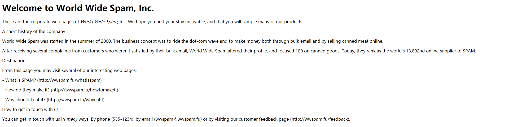

# 自动添加标签
> 项目来自[《Python基础教程》](https://www.ituring.com.cn/book/2118)中的第20章——项目1：自动添加标签 

## 简介
假设你要将一个文件用作网页，而给你文件的人嫌麻烦，没有以HTML格式编写它。你不想手工添加需要的所有标签，想编写一个程序来自动完成这项工作。

大致而言，你的任务是对各种文本元素（如标题和突出的文本）进行分类，再清晰地标记它们。就这里的问题而言，你将给文本添加HTML标记，得到可作为网页的文档，让Web浏览器能够显示它。然而，创建基本引擎后，完全可以添加其他类型的标记（如各种形式的XML和LATEX编码）。对文本文件进行分析后，你甚至可以执行其他的任务，如提取所有的标题以制作目录。

你拿到的文本可能包含一些线索（突出的文本形如\*like this\*），但要让程序能够猜测出文档的结构，可能需要一些技巧。

着手编写代码前，先来定义一些目标。
* 输入无需包含人工编码或标签
* 程序需要能够处理不同的文本块（如标题、段落和列表项）以及内嵌文本（如突出的文本和URL）
* 虽然这个实现添加的是HTML标签，但应该很容易对其进行扩展，以支持其他标记语言

另外还需要一个文档用于测试：
> 代码清单1 一个纯文本文档（test_input.txt）
```
Welcome to World Wide Spam, Inc. 

These are the corporate web pages of *World Wide Spam*, Inc. We hope 
you find your stay enjoyable, and that you will sample many of our 
products. 

A short history of the company 

World Wide Spam was started in the summer of 2000. The business 
concept was to ride the dot-com wave and to make money both through 
bulk email and by selling canned meat online. 

After receiving several complaints from customers who weren't 
satisfied by their bulk email, World Wide Spam altered their profile, 
and focused 100  on canned goods. Today, they rank as the world's
13,892nd online supplier of SPAM. 

Destinations 

From this page you may visit several of our interesting web pages:  

  - What is SPAM? (http://wwspam.fu/whatisspam) 

  - How do they make it? (http://wwspam.fu/howtomakeit)  
  
  - Why should I eat it? (http://wwspam.fu/whyeatit) 
  
How to get in touch with us 

You can get in touch with us in *many* ways: By phone (555-1234), by 
email (wwspam@wwspam.fu) or by visiting our customer feedback page 
(http://wwspam.fu/feedback).
```
要对实现进行测试，只需将这个文档作为输入，并在Web浏览器中查看结果（或直接检查添加的标签）即可。

## 有用的工具
* 读写文件，至少要从标准输入（sys.stdin）读取以及使用print进行输出
* 可能需要迭代输入行
* 需要使用一些字符串方法
* 可能用到一两个生成器
* 可能需要模块re

## 初次实现
首先要做的事情之一是将文本分成段落，也就是上面文档中一个或多个空行之间的部分。比段落更准确的说法是块（block），因为块也可以指标题和列表项。

### 找出文本块
要找出这些文本块，一种简单的方法是，收集空行前的所有行并将它们返回，然后重复这样的操作。不需要收集空行，因此不需要返回空文本块（即多个空行）。另外，必须确保文件的最后一行为空行，否则无法确定最后一个文本块到哪里结束。（当然，有其他确定这一点的方法）下面是这种方法的一种实现：
> 代码清单2 一个文本块生成器（util.py）
```
def lines(file):
    for line in file:
        yield line
    yield '\n'

def blocks(file):
    block = []
    for line in lines(file):
        if line.strip():
            block.append(line)
        elif block:
            yield ''.join(block).strip()
            block = []
```
生成器lines是个简单的工具，在文件末尾添加一个空行。生成器blocks实现了刚才描述的方法。生成文本块时，将其包含的所有行合并，并将两端多余的空白（如列表项缩进和换行符）删除，得到一个表示文本块的字符串。将这些代码存储在文件util.py中，意味着稍后可在程序中导入这些生成器。
### 添加一些标记
使用代码清单2提供的基本功能，可创建简单的标记脚本。为此，可按如下基本步骤进行。
1. 打印一些起始标记
2. 对于每个文本块，在段落标签内打印它
3. 打印一些结束标记

这不太难，但用处也不大。这里假设要将第一个文本块放在一级标题标签（h1）内，而不是段落标签内。另外，还需将用星号括起来的文本改成突出文本（使用标签em）。这样程序将更有用一些。由于已经编写好了函数blocks，使用re.sub实现这些需求的代码非常简单，如代码清单3所示。
> 代码清单3 一个简单的标记程序（simple_markup.py）
```
import sys, re
from util import *

print('<html><head><title>...</title><body>')

title = True
for block in blocks(sys.stdin):
    block = re.sub(r'\*(.+?)\*', r'<em>\1</em>', block)
    if title:
        print('<h1>')
        print(block)
        print('</h1>')
        title = False
    else:
        print('<p>')
        print(block)
        print('</p>')

print('</body></html>')
```
要执行这个程序，并将前面的示例文件作为输入，可像下面这样做：

```python simple_markup.py < test_input.txt > test_output.html```

这样，文件test_output.html将包含生成的HTML代码。下图是在Web浏览器中显示这些HTML代码的结果。


这个原型虽然不是很出色，但确实执行了一些重要任务。它将文本分成可独立处理的文本块，再依次对每个文本块应用一个过滤器（这个过滤器是通过调用re.sub实现的）。这种方法看起来不错，可在最终的程序中使用。

如果要扩展这个原型，该如何办呢？可在for循环中添加检查，以确定文本块是否是标题、列表项等。为此，需要添加其他的正则表达式，代码可能很快变得很乱。更重要的是，要让程序输出其他格式的代码（而不是HTML）很难，但是这个项目的目标之一就是能够轻松地添加其他输出格式。

## 再次实现
为了提高可扩展性，需提高程序的模块化程度（将功能放在独立的组件中）。要提高模块化程度，方法之一是采用面向对象设计。你需要找出一些抽象，让程序在变得复杂时也易于管理。下面先来列出一些潜在的组件。
* 解析器：添加一个读取文本并管理其他类的对象
* 规则：对于每种文本块，都制定一条对应的规则。这些规则能够检测不同类型的文本块并相应地设置其格式
* 过滤器：使用正则表达式来处理内嵌元素
* 处理程序：供解析器用来生成输出。每个处理程序都生成不同的标记

这里的设计虽然不太详尽，但至少让你知道应如何将代码分成不同的部分，并让每部分都易于管理。

### 处理程序
处理程序负责生成带标记的文本，并从解析器那里接受详细指令。假设对于每种文本块，它都提供两个处理方法：一个用于添加起始标签，另一个用于添加结束标签。例如，它可能包含用于处理段落的方法start_paragraph和end_paragraph。生成HTML代码时，可像下面这样实现这些方法：
```
class HTMLRenderer:
    def start_paragraph(self):
        print('<p>')
    def end_paragraph(self):
        print('</p>')
```
当然，对于其他类型的文本块，需要提供类似的处理方法。这好像足够灵活了：要添加其他类型的标记，只需再创建相应的处理程序（或渲染程序），并在其中包含添加相应起始标签和结束标签的方法。

如何处理正则表达式呢？你可能还记得，函数re.sub可通过第二个参数接受一个函数（替换函数）。这样将对匹配的对象调用这个函数，并将其返回值插入文本中。这与前面讨论的处理程序理念很匹配——你只需让处理程序实现替换函数即可。例如，可像下面这样处理要突出的内容：
```
def sub_emphasis(self, match):
    return '<em>{}</em>'.format(match.group(1))
```
除start、end和sub方法外，还有一个名为feed的方法，用于向处理程序提供实际文本。在简单的HTML渲染程序中，只需像下面这样实现这个方法：
```
def feed(self, data):
    print(data)
```
### 处理程序的超类
为提高灵活性，我们来添加一个Handler类，它将是所有处理程序的超类，负责处理一些管理性细节。在有些情况下，不通过全名调用方法（如start_paragraph），而是使用字符串表示文本块的类型（如'paragraph'）并将这样的字符串提供给处理程序将很有用。为此，可添加一些通用方法，如start(type)、end(type)和sub(type)。另外，还可让通用方法start、end和sub检查是否实现了相应的方法（例如，start('paragraph')检查是否实现了start_paragraph）。如果没有实现，就什么都不做。这个Handler类的实现如下：
```
class Handler:
    def callback(self, prefix, name, *args):
        method = getattr(self, prefix+name, None)
        if callable(method):
            return method(*args)
    def start(self, name):
        self.callback('start_', name)
    def end(self, name):
        self.callback('end_', name)
    def sub(self, name):
        def substitution(match):
            result = self.callback('sub_', name, match)
            if result is None:
                result = match.group(0)
            return result
        return substitution
```
对于这些代码，有几点需要说明。
* 方法callback负责根据指定的前缀（如'start_'）和名称（如'paragraph'）查找相应的方法。这是通过使用getattr并将默认值设置为None实现的。如果getattr返回的对象是可调用的，就使用额外提供的参数调用它。例如，调用handler.callback('start_', 'paragraph')时，将调用方法handler.start_paragraph且不提供任何参数——如果start_paragraph存在的话
* 方法start和end都是辅助方法，它们分别使用前缀start_和end_调用callback
* 方法sub稍有不同。它不直接调用callback，而是返回一个函数，这个函数将作为替换函数传递给re.sub（这就是它只接受一个匹配对象作为参数的原因所在）

下面来看一个示例。假设HTMLRenderer是Handler的子类，并像前一节介绍的那样实现了方法sub_emphasis。现在假设变量handler存储着一个HTMLRenderer实例。
```
>>> from handlers import HTMLRenderer
>>> handler = HTMLRenderer()
```
在这种情况下，调用handler.sub('emphasis')的结果将如何呢？
```
>>> handler.sub('emphasis')
<function substitution at 0x168cf8>
```
将返回一个函数（substitution）。如果你调用这个函数，它将调用方法handler.sub_emphasis。这意味着可在re.sub语句中使用这个函数：
```
>>> import re
>>> re.sub(r'\*(.+?)\*', handler.sub('emphasis'), 'This *is* a test')
'This <em>is</em> a test'
```